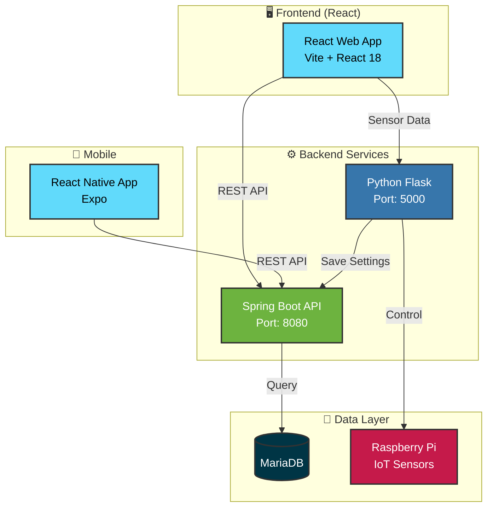

# 🐔 Smart Chicken Farm Management System

IoT 기반 스마트 양계장 통합 관리 시스템

실시간 환경 모니터링, 자동 제어, 데이터 분석을 통한 효율적인 양계장 운영 솔루션입니다.

## 📑 목차

- [기술 스택](#-기술-스택)
- [시스템 아키텍처](#-시스템-아키텍처)
- [주요 기능](#-주요-기능)
- [설치 및 실행](#️-설치-및-실행)
- [프로젝트 구조](#-프로젝트-구조)
- [API 문서](#-api-문서)
- [환경 설정](#-환경-설정)

## 🚀 기술 스택

- **Framework**: React 18.3
- **Build Tool**: Vite 6.0
- **Routing**: React Router DOM 7.0
- **State Management**: Redux Toolkit
- **Charts**: Chart.js, Recharts
- **Styling**: CSS Modules
- **HTTP Client**: Axios

## 🏗️ 시스템 구조



## 📋 주요 기능

### 🌡️ 실시간 환경 모니터링
- 온도, 습도, 조도, CO2, CO, NH3 센서 데이터 실시간 수집
- 5초 간격 자동 업데이트
- 시각화된 대시보드 (게이지, 차트)

### 🔔 위험 알림 시스템
- 임계값 초과 시 자동 알림 팝업
- 알림 기록 저장 및 조회
- 카테고리별 필터링 (온도, 습도, CO2, CO, NH3, 조도)

### 📊 데이터 분석
- 일일/주간/월간 통계
- 트렌드 분석 차트
- 환경 점수 계산 (Good/Fair/Poor)

### 💡 스마트 제어
- **LED 조명**: 자동/수동 모드, 수면 시간 설정
- **환기 팬**: 습도/CO2/CO 기반 자동 제어
- **서보 모터**: 온도 기반 문 개폐

### 🐔 개체 관리
- 배치별 닭 개체 등록 및 관리
- 건강 상태 모니터링
- 폐사 처리 및 통계

### 💉 예방접종 관리
- 접종 스케줄 자동 생성
- 개체별/배치별 접종 기록
- 접종 이력 조회

### 📝 관찰일지
- 일일 관찰 기록 작성
- 카테고리별 분류 (건강, 사료, 청소)
- 온습도 자동 기록

### 📹 CCTV 모니터링
- 실시간 영상 스트리밍
- 녹화 영상 재생
- 알람 기록 연동

### ⚙️ 환경 설정
- 센서 임계값 설정
- 제어 장치 설정
- 수면 시간 설정
- 위치 정보 설정 (일출/일몰 계산)

## 🛠️ 설치 및 실행

### 1. Frontend (Web) 실행

```bash
# 의존성 설치
npm install

# 개발 서버 실행 (http://localhost:5173)
npm run dev

# 프로덕션 빌드
npm run build

# 빌드 결과 미리보기
npm run preview
```

### 2. Backend (Spring Boot) 실행

```bash
# Maven 빌드
mvn clean install

# 애플리케이션 실행
mvn spring-boot:run

# 또는 JAR 파일 실행
java -jar target/chickenFarm-0.0.1-SNAPSHOT.jar
```

**Backend 서버**: `http://192.168.30.152:8080`

### 3. IoT (Raspberry Pi) 실행

```bash
# Python 의존성 설치
pip install flask requests RPi.GPIO Adafruit_DHT

# 환경 모니터링 시작
python env_monitor_simple.py

# 또는 백그라운드 실행
nohup python env_monitor_simple.py &
```

**Python 서버**: `http://192.168.30.240:5000`

### 4. Mobile (React Native) 실행

```bash
# 의존성 설치
npm install

# Expo 개발 서버 실행
npx expo start

# Android 실행
npx expo start --android

# iOS 실행
npx expo start --ios
```

## 📁 프로젝트 구조

```
frontend-chickenfarm/
├── src/
│   ├── api/              # API 호출 함수
│   ├── assets/           # 이미지, 아이콘
│   ├── common/           # 공통 컴포넌트
│   │   ├── Button.jsx
│   │   ├── Input.jsx
│   │   ├── Modal.jsx
│   │   ├── DataTable.jsx
│   │   └── ...
│   ├── context/          # React Context
│   │   └── AlertContext.jsx
│   ├── layout/           # 레이아웃 컴포넌트
│   │   ├── Header.jsx
│   │   ├── Login.jsx
│   │   └── cctv/
│   ├── page/             # 페이지 컴포넌트
│   │   ├── Home.jsx
│   │   ├── RealTimeMonitoring.jsx
│   │   ├── EnvDashboard.jsx
│   │   ├── TrendAnalysis.jsx
│   │   ├── ChickenManagement.jsx
│   │   ├── Diary.jsx
│   │   ├── ChickenInoculation.jsx
│   │   ├── AlertHistory.jsx
│   │   └── EnvSettings.jsx
│   ├── services/         # API 서비스
│   │   └── api.js
│   ├── utils/            # 유틸리티 함수
│   ├── App.jsx
│   └── main.jsx
├── public/
├── package.json
└── vite.config.js

backend-chickenfarm/
├── src/main/java/com/backend/chickenFarm/
│   ├── member/           # 회원 관리
│   ├── chicken/          # 개체 관리
│   ├── chicken_batch/    # 배치 관리
│   ├── chicken_farm/     # 농장 관리
│   ├── danger_notice/    # 위험 알림
│   ├── env_settings/     # 환경 설정
│   ├── farm_status/      # 농장 상태
│   ├── inoculation/      # 예방접종
│   ├── note/             # 관찰일지
│   └── sensor_th/        # 센서 데이터
├── src/main/resources/
│   ├── mapper/           # MyBatis XML
│   └── application.properties
└── pom.xml

app-chickenfarm/          # React Native 모바일 앱
├── app/
│   ├── authorization/
│   │   ├── signin.jsx
│   │   └── signup.jsx
│   └── (tabs)/
├── components/
└── package.json
```

## 📡 API 문서

### Backend API (Spring Boot)

**Base URL**: `http://192.168.30.152:8080/api`

#### 회원 관리
- `POST /member` - 로그인
- `PUT /member/password` - 비밀번호 변경
- `PUT /member/name` - 이름 변경
- `POST /member/signup` - 회원가입

#### 개체 관리
- `GET /chicken/{batchId}` - 배치별 개체 조회
- `PUT /chicken/death` - 폐사 처리
- `PUT /chicken/update-health` - 건강 상태 수정

#### 배치 관리
- `GET /batch/info` - 배치 정보 조회
- `POST /batch` - 배치 등록
- `PUT /batch/shipment` - 배치 출하

#### 예방접종
- `GET /inoculation/batch/{batchId}` - 배치별 개체 조회
- `POST /inoculation/perform` - 접종 실행
- `DELETE /inoculation/perform` - 접종 삭제
- `GET /inoculation/schedule/{batchId}` - 접종 스케줄 조회

#### 위험 알림
- `POST /danger/insert` - 알림 저장
- `GET /danger/list/{farmNum}` - 알림 목록 조회

#### 환경 설정
- `GET /env-settings` - 설정 조회
- `POST /env-settings` - 설정 저장

### Python API (Flask)

**Base URL**: `http://192.168.30.240:5000/api`

#### 센서 데이터
- `GET /realtime` - 실시간 센서 데이터
- `GET /sensor-history/{type}` - 센서 히스토리
- `GET /status` - 시스템 상태

#### 환경 설정
- `GET /settings/current` - 현재 설정 조회
- `POST /settings/update` - 설정 업데이트
- `POST /settings/apply` - 설정 적용

## ⚙️ 환경 설정

### 1. 데이터베이스 설정

```sql
-- database_schema.sql 실행
CREATE DATABASE team_db;
USE team_db;

-- 테이블 생성 스크립트 실행
SOURCE database_schema.sql;
```

### 2. Backend 설정

`src/main/resources/application.properties`:

```properties
spring.datasource.url=jdbc:log4jdbc:mariadb://192.168.30.152:3306/team_db
spring.datasource.username=your_username
spring.datasource.password=your_password

server.servlet.context-path=/api
```

### 3. Frontend 설정

`src/services/api.js`:

```javascript
const PYTHON_SERVER = 'http://192.168.30.240:5000'
const BACKEND_SERVER = 'http://192.168.30.152:8080'
```

### 4. IoT 설정

`env_monitor_simple.py`:

```python
BACKEND_URL = 'http://192.168.30.152:8080/api/env-settings'
FLASK_PORT = 5000
```

## 🔐 기본 계정

- **ID**: admin
- **PW**: admin1234
- **Role**: ADMIN

## 🐛 트러블슈팅

### 로그인 실패
- 백엔드 서버 실행 확인: `http://192.168.30.152:8080/api/member`
- 네트워크 연결 확인
- 브라우저 콘솔에서 에러 확인

### 센서 데이터 수신 실패
- Python 서버 실행 확인: `http://192.168.30.240:5000/api/status`
- Raspberry Pi 네트워크 연결 확인
- 센서 하드웨어 연결 확인

### CORS 에러
- Backend의 `CorsConfig.java` 확인
- 허용된 Origin 목록에 프론트엔드 URL 추가

## 👥 팀 정보

**Team**: dc.kim  
**Project Period**: 2025.10 - 2025.10

## 📄 라이선스

This project is licensed under the MIT License.
